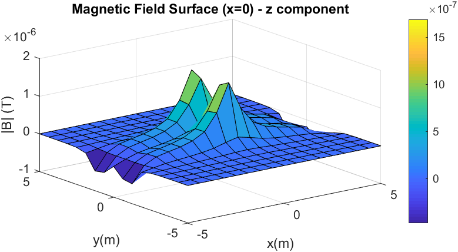
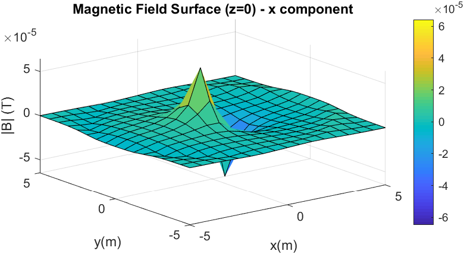
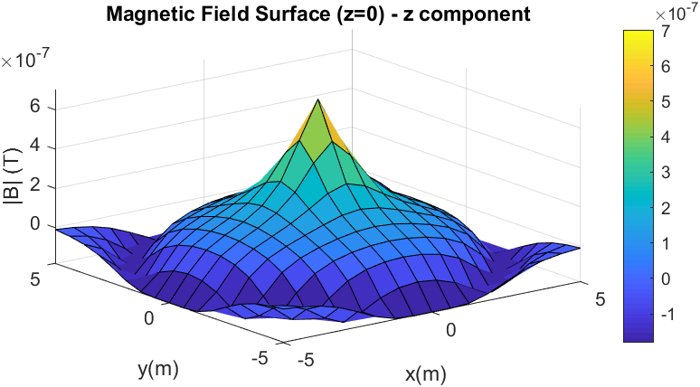
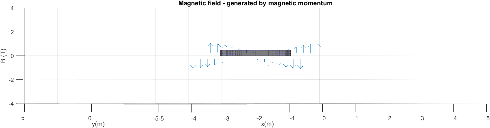
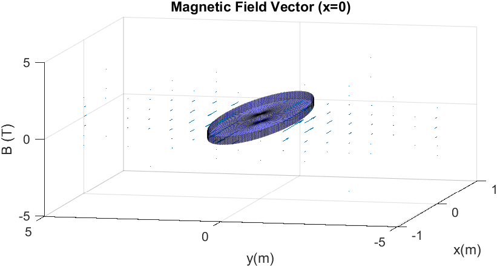
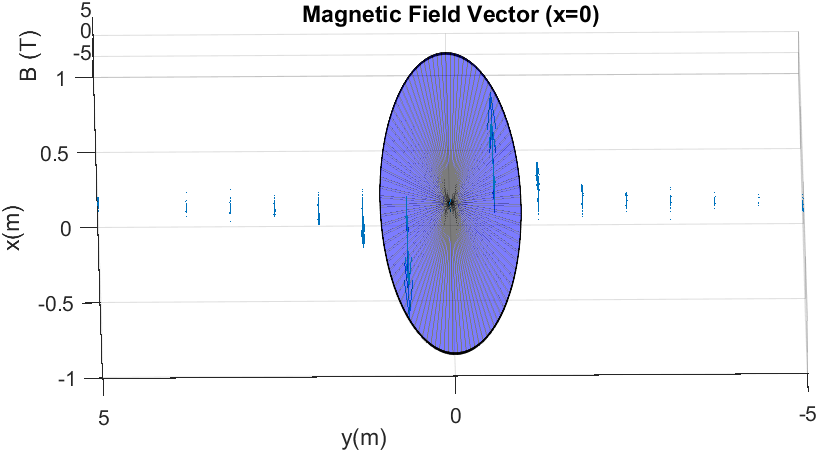

# MagneticFieldCylinder
This code calculates the magnetic field of a cylinder by infinitesimal contributions at any point in space for  given values of R, J0, n and H, specified later on the calculations.
The  modules and vectorial representations that are obtained thanks to the support of Matlab.

## Results
### Surface

### Quiver

